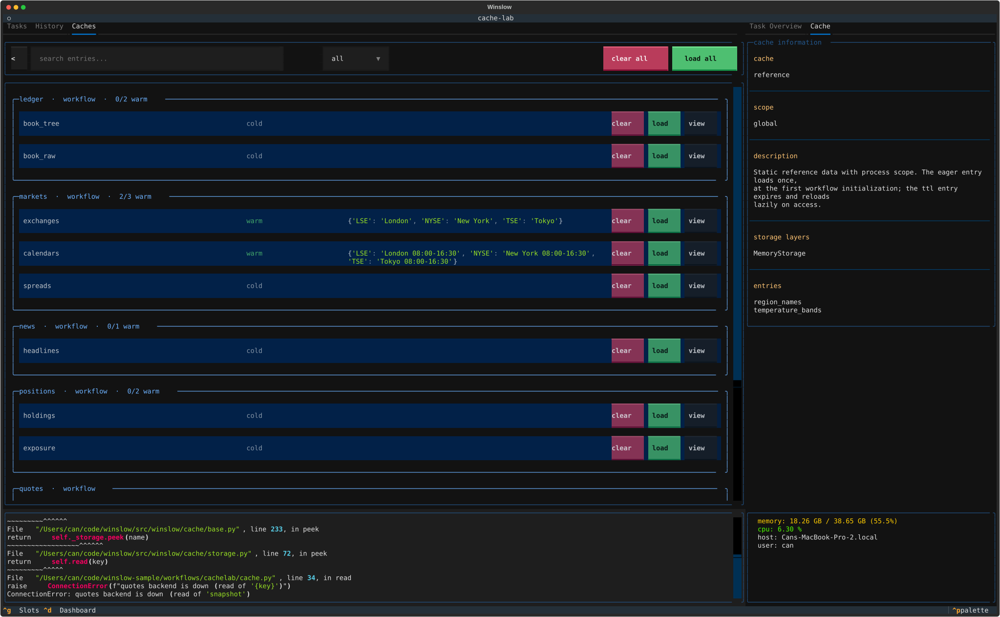

# Caching

Winslow has two cache scopes, declared the same way and read the same way:

| Cache | Scope | Constructed with |
| --- | --- | --- |
| `GlobalCache` | one process, shared by the workflows | the orchestrator config |
| `WorkflowCache` | one workflow session | the workflow config |

For data that lives and dies with one task, stay with the task-local tools: a plain
`functools.cached_property` for instance memoization, and
[`transient_property`](tasks.md#share-a-value-between-check-and-run) for a value that one execution
pass of a batch shares between `check()` and `run()`. Reach for a cache class when tasks, hooks or
workflows share the data.

## Declare a cache

A cache class lives in a `cache.py` file, or in any module of a `cache/` package - a hard rule, not
a convention: the framework imports only these locations. A `GlobalCache`
is collected from the whole project tree; a `WorkflowCache` from the directory of its workflow.
Share loader helpers on a base class with `Meta.abstract`, the same way as for a workflow or a
task (see [Share a base class](workflows.md#share-a-base-class)). One file can declare both
scopes:

```python title="sample cache"
--8<-- "examples/weather/cache.py:declare"
```

Declare each field with `@entry`. The bare form is lazy and behaves like `cached_property` plus a
lock: the field computes on first access, once per instance, and two threads that hit it cold
compute it once. The called form takes four options:

- `eager=True` populates the field at workflow initialization - `cities` and `codes` above (see
  [Prepopulate a cache](#prepopulate-a-cache)).
- `depends_on="cities"` (a name or a tuple) declares that this field is computed from another.
  It gates validation and the [invalidation cascade](#cache-invalidation).
- `ttl=300` expires the value 300 seconds after its computation; the next access recomputes.
- `display_style=DisplayStyle.TREE` selects how the TUI renders the value (see
  [User interface](#user-interface)).

## Prepopulate a cache

Entries annotated with `eager=True` are pre-populated during the workflow initialization, in
parallel. An entry with dependencies (`depends_on=...`) waits for its dependencies to be
pre-populated first:

```python
class Forecast(WorkflowCache):
    @entry(eager=True)
    def cities(self):
        ...

    @entry(eager=True, depends_on="cities")
    def city_index(self):
        return {city: index for index, city in enumerate(self.cities)}
```

Disable the parallel pre-population with the `--disable-concurrency` command-line argument, or by
selecting the option on the workflow start form in the TUI.

## Read a cache

Tasks, workflows and graphs carry both containers; each cache is an attribute on its container,
under the cache name. The name is generated from the class name, snake-cased - or taken from a
`name` override, which must match `[a-z_][a-z0-9_]*`:

```python
class SensorReadings(WorkflowCache):
    @entry
    def levels(self): ...


class Calibrate(Task):
    def run(self):
        # the snake-cased class name is the attribute:
        readings = self.workflow_cache.sensor_readings.levels
        ...
```

```python
class SensorReadings(WorkflowCache):
    name = "sensors"

    @entry
    def levels(self): ...


class Calibrate(Task):
    def run(self):
        # the override is the attribute:
        readings = self.workflow_cache.sensors.levels
        ...
```

`self.global_cache` serves the global scope the same way:

```python
class ReportCity(Task):
    def run(self):
        station = self.global_cache.stations.codes[self.city]
        ...
```

Outside an instance of a workflow, a graph or a task, the caches are accessed through two module
functions: `get_global_cache()` and `get_workflow_cache()`. A classmethod hook is the common case -
it runs before a task instance exists:

```python
from winslow.cache import get_global_cache, get_workflow_cache

@classmethod
def get_parameters(cls, workflow_config):
    codes = get_global_cache().stations.codes
    return [{"city": c} for c in get_workflow_cache().forecast.cities if c in codes]
```

!!! info "Which workflow does `get_workflow_cache()` return?"

    The one being initialized at that moment - each workflow's hooks see their own caches, even
    with several workflows live. Everywhere else, use `self.workflow_cache` instead.

## Cache invalidation

A dependent entry declares its upstream with `depends_on` - the declarations form the chain that
an invalidation follows:

```python
class Forecast(WorkflowCache):
    @entry
    def cities(self): ...

    @entry(depends_on="cities")
    def city_index(self): ...

    @entry(depends_on="city_index")
    def alerts(self): ...

    @entry(ttl=300)
    def conditions(self): ...
```

`invalidate` takes one or more entry names, and drops each with its declared dependents,
transitively. `invalidate_all` drops everything. A dropped entry recomputes on its next access -
an eager field too:

```python
cache = self.workflow_cache.forecast

cache.invalidate("cities")               # drops cities, city_index and alerts; conditions stays
cache.invalidate("city_index")           # drops city_index and alerts; cities stays
cache.invalidate("alerts", "conditions")  # drops both, in one call
cache.invalidate_all()                   # drops every entry of the instance
```

Tune the [`ttl`](#declare-a-cache) per entry, to the pace of that entry's data. Reach for `ttl`
when time makes a value stale; reach for `invalidate` when an event makes it wrong.

## Clear the cache

Start a run cold with the `--clear-cache` command-line argument: every entry of both scopes is
invalidated at workflow initialization, before the eager population, and the recomputed values are
written back to every persistent tier.

```console
$ winslow run --mode headless --workflow weather --clear-cache
```

In the TUI, the same option is available on the workflow start form, with the other orchestrator
options: select it before starting the session.

## User interface

When the project declares at least one cache, the workflow screen gains a Caches tab, next to the
task list. The tab shows one card per cache, across both scopes. Each card lists the declared
entries, and each row shows the live entry state - `cold`, `warm`, `stale`, `computing`,
`errored` - with a preview of the value:



Every row carries three actions:

- **clear** invalidates the entry, together with its declared dependents (see
  [Cache invalidation](#cache-invalidation)).
- **load** runs the loader now. Use it after a clear to reload a value without waiting for the
  next read.
- **view** opens the full value in a modal, rendered per the entry's `display_style`.

`display_style` is an `@entry` option with three forms. `RAW`, the default, pretty-prints the
value. `TREE` renders a container as a tree that expands level by level, for a large value that a
flat print would flood. A callable is a custom renderer: it takes the value and returns the string
to show:

```python
from winslow.cache import DisplayStyle, WorkflowCache, entry


class Forecast(WorkflowCache):
    @entry  # RAW is the default
    def conditions(self): ...

    @entry(display_style=DisplayStyle.TREE)
    def alerts(self): ...

    @entry(display_style=lambda frame: frame.to_string())
    def readings(self): ...
```

The header narrows the pane: search the entries by name, or select one scope. The bulk actions
follow the narrowed view - `clear all` invalidates every cache with a visible entry, and
`load all` loads every visible entry, in parallel like the
[eager population](#prepopulate-a-cache). Select a card to see the cache details in the overview pane: its scope, storage layers and
entries.

## Cache storage

Values live behind a storage backend, declared on the cache class with `storage_class`. The
default is `MemoryStorage`: values stay in the process, and a fresh session starts cold.

```python
class Forecast(WorkflowCache):
    storage_class = MemoryStorage  # the default

    @entry(ttl=300)
    def conditions(self): ...
```

Declare `JsonFileStorage` on a cache whose values should survive the process. A new process
starts warm from the files. Each entry lives at
`<cache root>/<namespace>/<cache-name>/<entry>.json`: open the file to inspect a value, delete
it to drop one.

Set the cache root with the `WINSLOW_CACHE_DIR` setting. The default is `.winslow/cache`,
relative to the working directory - set an absolute path so every entry point of the project
shares one cache. Export the value, or put it in a `.env` file: the search for the file starts in
the working directory and walks up.

```ini title=".env"
WINSLOW_CACHE_DIR=/srv/etl/winslow-cache
```

!!! warning "For `JsonFileStorage`, the values must fit the JSON types"

    Store values that JSON can represent. Some types are converted: a tuple comes back as a list.
    A non-string dict key is converted to a string: `{1: "a"}` becomes `{"1": "a"}`.

```python
class Stations(GlobalCache):
    storage_class = JsonFileStorage  # one JSON file per entry

    @entry
    def codes(self): ...
```

Compose backends into tiers with `compose`; declaration order is read order. A read serves the
first hit and promotes it upward, a write runs bottom-up - the memory tier answers repeat reads,
the file tier keeps the values across restarts:

```python
class Stations(GlobalCache):
    storage_class = compose(MemoryStorage, JsonFileStorage)  # memory over file

    @entry
    def codes(self): ...
```

The `<namespace>` path segment is `global` for a `GlobalCache`. A `WorkflowCache` gets one
directory per run identity: declare a config option with `identifier=True` to put it in the
identity:

```python
class Etl(Workflow):
    region = ConfigOption(identifier=True, help_text="The market region of this run.")
```

```console
$ winslow run --workflow etl --region eu   # .winslow/cache/workflows/etl-eu-3f9a1c2b/
$ winslow run --workflow etl --region us   # .winslow/cache/workflows/etl-us-9d01f7a2/
```

!!! info "How is the directory name generated?"

    From the workflow name and its identifier values. The name and the scalar values form the
    readable prefix (`etl-eu`), and a short digest of the full identity is appended (`3f9a1c2b`).
    A list or other structured identifier counts in the digest, even though it stays out of the
    prefix. Same name and identifiers - same directory, on every run.

### Custom storage backends

Subclass `BaseStorage` to build a backend, and override the three methods. Return the `MISSING`
sentinel for a cold key, and return the stored record from `write`: the cache serves what the
write returns.

```python
from winslow.cache import MISSING, BaseStorage, StorageRecord


class RedisStorage(BaseStorage):
    def read(self, key):
        ...  # return a StorageRecord, or MISSING for a cold key

    def write(self, key, record):
        ...  # store the record, return the stored record

    def delete(self, key): ...
```

Declare `read_only = True` on a backend to make it a pure source inside a
[composed storage](#cache-storage): the writable tiers take the writes and the deletes, and after
an invalidation the next access re-reads through the source.

```python
class SeededRates(BaseStorage):
    read_only = True

    def read(self, key): ...
```

## A complete example

The `weather` example puts the pieces together: the caches from
[Declare a cache](#declare-a-cache) - here in full, with the file tier that persists the station
registry - next to the workflow that reads them. The loaders sleep to stand in for expensive
calls, so the cache effects are visible in the runtime.

```python title="examples/weather/cache.py"
--8<-- "examples/weather/cache.py"
```

```python title="examples/weather/workflow.py"
--8<-- "examples/weather/workflow.py"
```

[Download this example](https://github.com/winslow-workflow/winslow/tree/main/examples/weather)

Run it twice from `examples/weather/`, deleting the reports in between - the tasks are idempotent,
so a second run over an existing `state/` reports `COMPLETED_PREVIOUSLY` instead of running:

```console
$ winslow run --mode headless --workflow weather   # ~4s: every loader runs
$ rm -rf state                                     # delete the reports so the tasks run again
$ winslow run --mode headless --workflow weather   # ~2s: stations reads its file
```

Both runs write `state/summary.txt`. The second one skips the 2s station registry: the global
cache warm-starts from `.winslow/cache/global/stations/codes.json`. The forecast loaders run
again, because a new session builds fresh `WorkflowCache` instances.
