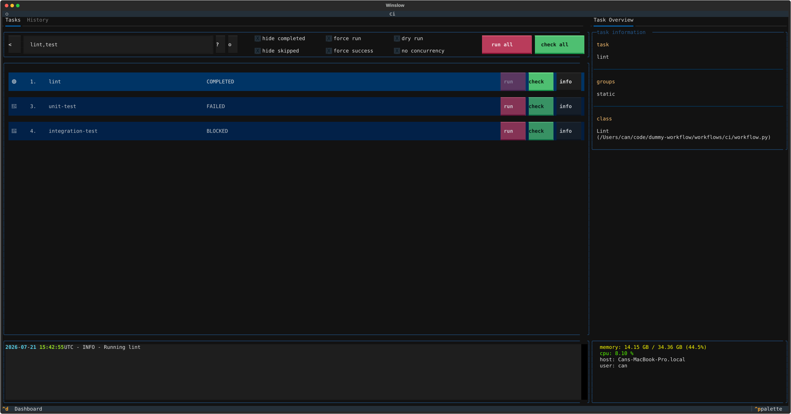

# Filters

Run or check a subset of the tasks with a filter expression. A filter selects the tasks by name or by
group, and the operators combine the selections. The `--filter` option and the search box of the
terminal UI accept the same language.

This example declares a group on each task (see [Groups](dependencies.md#groups)):

```python title="examples/ci/workflow.py"
--8<-- "examples/ci/workflow.py"
```

[Download this example](https://github.com/winslow-workflow/winslow/blob/main/examples/ci/workflow.py)

## Select by name

A bare word matches any task name that contains the word. The match is case-insensitive:

```bash
winslow run --filter 'lint'    # lint
winslow run --filter 'test'    # unit-test, integration-test
```

## Select by group

The `!g` command selects every task of a group. The long form is `!group`:

```bash
winslow run --filter '!g static'    # lint, typecheck
```

## Exclude with a negation

The `~` operator excludes instead of includes. It goes directly before the value. For a group, the
negation comes after the command:

```bash
winslow run --filter '~publish'      # The five tasks that are not publish-wheel.
winslow run --filter '!g ~static'    # The four tasks outside the static group.
```

## Combine the selections

The `&` operator demands both sides, and the `|` operator accepts either side. The words `and` and
`or` are aliases. A comma is a shorthand for `|`, and parentheses set the evaluation order:

```bash
winslow run --filter 'lint,test'                # lint, unit-test, integration-test
winslow run --filter '!g static,tests'          # The four tasks of the two groups.
winslow run --filter '!g tests & ~integration'  # unit-test
winslow run --filter '~(lint | typecheck)'      # The four tasks that are neither.
```

## The search box

The terminal UI has a search box that accepts the same expressions. The task list narrows as you type.



!!! tip "Custom filters"

    A plugin can add a custom filter command to this language. See [Filter plugins](filter-plugins.md).
