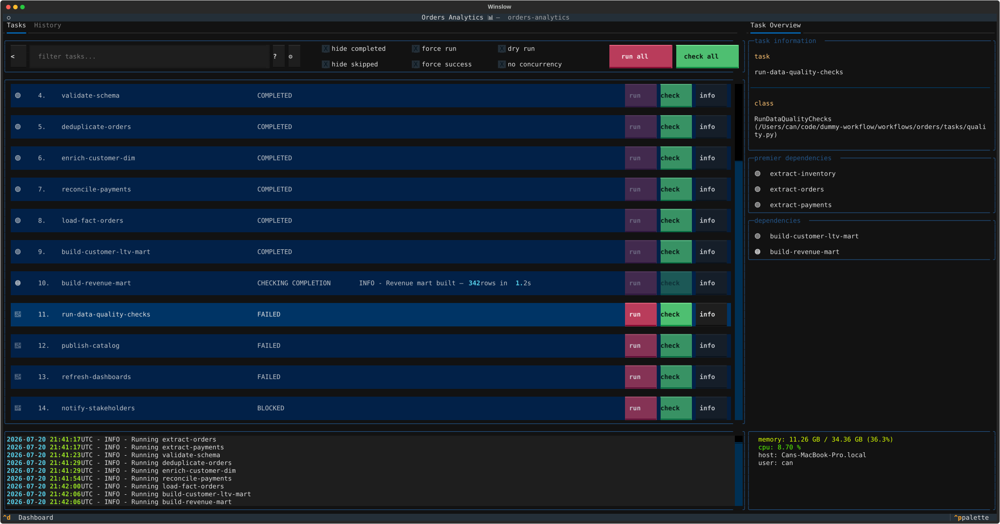
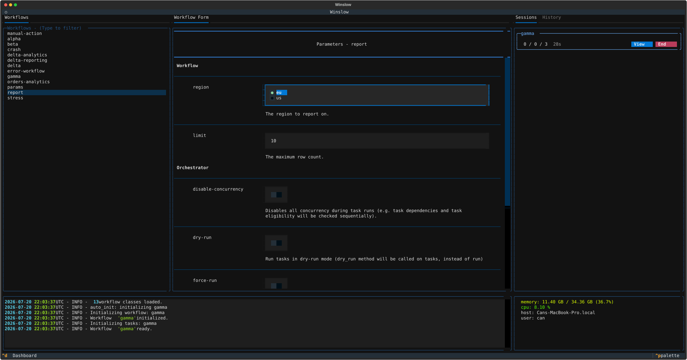

# Winslow

**A workflow and state manager with a terminal UI.**

Winslow runs work as a set of small tasks. Each task declares the tasks it depends on. Winslow builds the
dependency graph and runs the tasks in the correct order.

Each task knows two things: how to do its work, and how to report that the work is already done. Winslow
checks the second before it does the first.



## The core idea: run and check

Two methods form the whole contract:

- `run()` makes a change.
- `check()` reports whether the wanted end state is already true.

Winslow calls `check()` before it runs a task. If `check()` returns true, Winslow marks the task completed and does
not run it. If it returns false, Winslow calls `run()`, then calls `check()` again to confirm the result.

This makes a workflow idempotent and resumable. Stop a workflow in the middle and start it again. Winslow
continues from the point it reached.

## Adopt Winslow one task at a time

The `run()` method is optional. The `check()` method is not. A task that omits `run()` changes nothing and
only reports a state.

A workflow built only from such tasks is a health check tool. It reads a system and it writes nothing. Two
uses follow from this:

**A status view over a legacy system.** Describe the wanted state of the system as a set of checks. The
terminal UI then shows which parts of the system are correct, and which parts are not. The legacy process
continues to run as before. Winslow only observes it.

**From a report to an automation.** Add a `run()` method to one task at a time. Winslow automates that task from the moment
that the method exists. The other tasks stay as checks. The workflow is usable at every step of the migration,
and no step needs a large change.

**Part automation, part human action.** The `run()` method can complete a part of the work and leave the
rest to a person. A release task can open a pull request in `run()`. Its `check()` passes only when the
change is in the main branch. Until a person merges the pull request, the task shows the `ACTION REQUIRED`
state. The signal table in [Tasks](tasks.md) lists the `require_action` signal that reports this state.

## Is Winslow the right tool?

Winslow is not the right tool for every situation. Many workflow tools exist, and they differ more
than their descriptions show. The [tool selector](selector.html) compares Winslow with the common
alternatives under the same rules. The grid shows how each tool knows that work is already done. It
also covers fan-out, execution, scheduling, interfaces, and licenses. Select the properties that your
situation requires. The grid removes the tools that do not fit.

## Install

```bash
uv add "winslow[tui]"      # or: pip install 'winslow[tui]'
```

Winslow needs Python 3.12 or later. The `tui` extra installs the terminal UI. For headless runs in cron or CI,
the `winslow` package alone is sufficient.

## Quick start

A workflow is a directory. It holds a `Workflow` class and the `Task` classes that belong to that workflow.
The filename `workflow.py` marks the directory as a workflow package. Every `.py` file beside it belongs to
the same workflow.

Put this content in `workflows/etl/workflow.py`:

```python title="examples/etl/workflow.py"
--8<-- "examples/etl/workflow.py"
```

[Download this example](https://github.com/winslow-workflow/winslow/blob/main/examples/etl/workflow.py)

!!! tip "Project layout"

    The example holds the workflow and the tasks in one file, which keeps it short. A real workflow puts the
    tasks in their own files beside `workflow.py`. Winslow imports every `.py` file in the directory. See
    [Workflows](workflows.md).

Start the terminal UI from that directory:

```bash
winslow run
```

Or run the workflow headless:

```bash
winslow run --mode headless --workflow etl
```

Run the same command a second time. Winslow runs neither task, because `check()` already returns true.

## Pass options to a workflow

A workflow declares its runtime options with `ConfigOption`. Each option becomes a command line argument. A
task reads the values from `self.workflow_config`.

```python title="examples/report/workflow.py"
--8<-- "examples/report/workflow.py"
```

[Download this example](https://github.com/winslow-workflow/winslow/blob/main/examples/report/workflow.py)

Pass each value on the command line:

```bash
winslow run --mode headless --workflow report --region eu --limit 5
```

An option name uses an underscore in Python and a dash on the command line. The option `max_rows` thus becomes
`--max-rows`.

The `region` option is required. Winslow stops before it runs a task if the command omits the value:

```
Workflow - report: error: the following arguments are required: --region
```

The `limit` option has a default, so the command can omit it. The `choices` list is also enforced:

```
Workflow - report: error: argument --region: invalid choice: 'xx' (choose from eu, us)
```

The terminal UI presents the same options as a form. Fill the form in, then start the workflow.



!!! info "The environment"

    Winslow reads the environment name from the `WINSLOW_ENV` variable, and the default value is `dev`. A task
    and a workflow both read the value from `self.env`.

## Filters

Run or check a subset of the tasks with a filter expression:

```bash
winslow run --filter test    # Every task whose name contains "test".
```

A filter also selects by group, and the operators combine the selections. The search box of the terminal
UI accepts the same language. See [Filters](filters.md).

## Trust model

!!! warning "Winslow runs the code in the directory that you start it from"

    Treat a workflow directory like a `Makefile` or a `conftest.py`. Start Winslow only in a directory that
    you trust.

At startup Winslow searches the current directory and every subdirectory below it for a `workflow.py` file. It
then imports each `workflow.py` file, every other `.py` file in the same directory tree, and the top-level
modules for the orchestrator discovery. Winslow ignores a directory whose name starts with a full stop or an
underscore. These imports happen before the first prompt.

Plugin autodiscovery is also opt-out. An installed package that exposes a winslow entry point loads at
startup. The [plugin guide](plugins.md) shows how to constrain the discovery. The
[security policy](https://github.com/winslow-workflow/winslow/blob/main/SECURITY.md) describes the full
trust model and the report process for a vulnerability.

## Where to go next

- [Workflows](workflows.md): declare a workflow, arrange the task files, and share code between workflows.
- [Tasks](tasks.md): the task lifecycle, and the method that each stage calls.
- [Dependencies](dependencies.md): order the tasks with the dependency graph, premier and terminal tasks, and groups.
- [Filters](filters.md): select a subset of the tasks by name or by group.
- [Parameterization](parameterization.md): turn one task class into many task instances.
- [Constraints](constraints.md): package a gate rule as a class, and share it between tasks.
- [Plugins](plugins.md): add a tab to the UI, replace a built-in pane, or add a filter command.
- [API reference](reference.md): generated from the source docstrings.
- [Tool selector](selector.html): compare Winslow with the alternative workflow tools.
