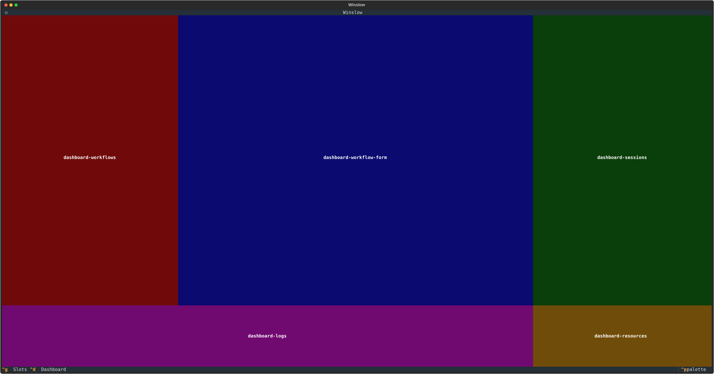
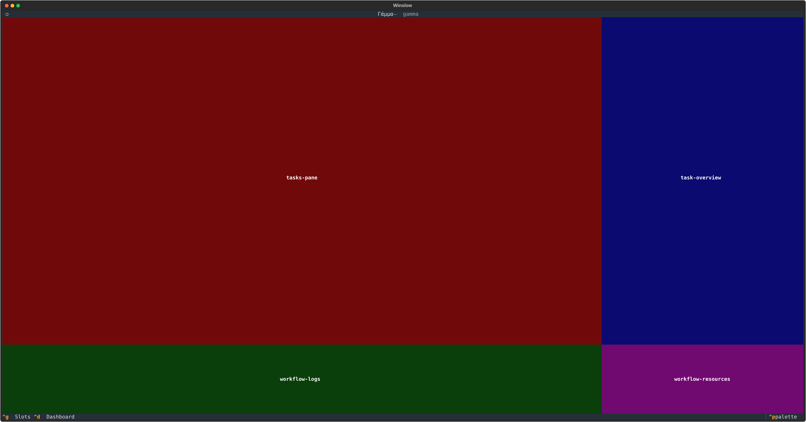

# UI plugins

A UI plugin extends the terminal UI without a fork. The UI is a set of named slots, and every pane in it is
a plugin that fills one slot. The built-in panes use the same mechanism, so a third-party plugin can sit
next to them, come before them, or replace one of them.

A UI plugin ships in a plugin package with an entry point in the `winslow.tui_plugins` group (see
[How Winslow finds a plugin](plugins.md#how-winslow-finds-a-plugin)).

## Write a UI plugin

A plugin declares a slot and a label, and builds one widget:

```python title="examples/winslow-sample-tui-plugin/winslow_sample_tui_plugin/dashboard.py"
--8<-- "examples/winslow-sample-tui-plugin/winslow_sample_tui_plugin/dashboard.py"
```

`create_widget` returns any Textual widget. The `context` argument carries the state of the screen:

| The screen | The context | The useful attributes |
| --- | --- | --- |
| Dashboard | `DashboardRenderContext` | `orchestrator`, `orchestrator_config` |
| Workflow | `WorkflowRenderContext` | `workflow`, `workflow_config`, `orchestrator_config` |
| Task info modal | `TaskDetailRenderContext` | `info` (a `TaskInfo` value, not the task), `logs` |
| Confirmation modal | `WorkflowConfirmationRenderContext` | `workflow_kls`, `form_values` |

A slot with one plugin shows the widget directly. A slot with two or more plugins becomes a tab bar, and
`label` names each tab. When one slot of a row becomes tabbed, the other slots of that row become tabbed
too, so the row keeps one visual line.

## The slots

Each screen declares its slots on the `Slots` class. Press `ctrl+g` on a screen and Winslow covers every
slot with its name, so you can see what each slot spans:



The dashboard slots and the built-in plugins in them:

| The slot | The built-in content |
| --- | --- |
| `DASHBOARD_WORKFLOWS` | The workflow selector. |
| `DASHBOARD_WORKFLOW_FORM` | The workflow form. |
| `DASHBOARD_SESSIONS` | The session list, with a History tab. |
| `DASHBOARD_LOGS` | The application logs. |
| `DASHBOARD_RESOURCES` | The system resources. |



The workflow screen slots:

| The slot | The built-in content |
| --- | --- |
| `TASKS_PANE` | The task list, with a History tab. |
| `TASK_OVERVIEW` | The overview of the selected task. |
| `WORKFLOW_LOGS` | The session logs. |
| `WORKFLOW_RESOURCES` | The system resources. |

Two slots live in modals, and not on a screen: `TASK_DETAIL` fills the task info modal, and
`WORKFLOW_CONFIRMATION` fills the confirmation modal before a workflow starts.

## Order the plugins in a slot

The `priority` value orders the plugins of one slot. A lower value comes first, and the first plugin is the
first tab. Each built-in plugin starts at 5, and the next one in the same slot is one higher. The values 0
to 4 are reserved for a plugin that must come before the built-in plugins:

```python
class SampleDashboardPlugin(UIPlugin):
    slot = Slots.DASHBOARD_WORKFLOWS
    label = "Sample"
    priority = 6      # After the built-in workflow selector.
```

Two plugins with the same priority order by their plugin name. Declare a priority instead of depending on
that order.

## Replace a built-in plugin

The `replace` argument evicts another plugin and takes its place. The target is the qualified plugin name
(see [The name of a plugin](plugins.md#the-name-of-a-plugin)). A built-in plugin has the prefix `builtin`.
This example puts a mood face on the system resources pane, and keeps the built-in stat widgets:

```python title="examples/winslow-sample-tui-plugin/winslow_sample_tui_plugin/mood.py"
--8<-- "examples/winslow-sample-tui-plugin/winslow_sample_tui_plugin/mood.py"
```

The plugin subclasses the built-in plugin, so it inherits the slot of its target. A replacement that
declares its own slot must declare the same slot as its target. A different slot is an error, because a
replacement changes the content of a pane and not the layout of the screen.

## A complete example

The `winslow-sample-tui-plugin` package holds the two plugins of this page:

```
winslow-sample-tui-plugin/
├── pyproject.toml
└── winslow_sample_tui_plugin/
    ├── dashboard.py     # adds a tab
    └── mood.py          # replaces the system resources pane
```

[Download this example](https://github.com/winslow-workflow/winslow/tree/main/examples/winslow-sample-tui-plugin)

The `pyproject.toml` declares the entry points:

```toml title="examples/winslow-sample-tui-plugin/pyproject.toml"
--8<-- "examples/winslow-sample-tui-plugin/pyproject.toml"
```

Install the package into the workflow project. An editable install keeps a local plugin live while
you work on it:

```bash
uv add --editable ../winslow-sample-tui-plugin
```

The command adds the dependency and a local source to the `pyproject.toml` of the project:

```toml title="pyproject.toml of the workflow project"
[project]
dependencies = [
    "winslow-sample-tui-plugin",
]

[tool.uv.sources]
winslow-sample-tui-plugin = { path = "../winslow-sample-tui-plugin", editable = true }
```

A plugin package can also add a command to the filter language (see
[Filter plugins](filter-plugins.md)).
