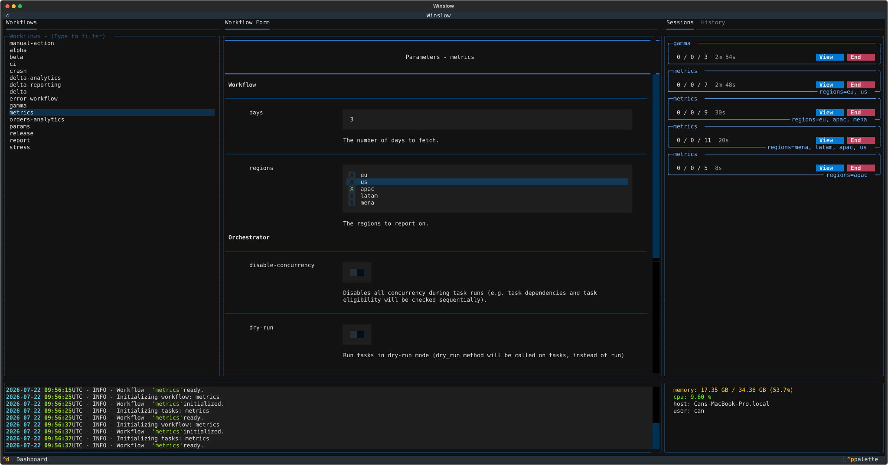

# Workflows

A workflow groups the tasks that belong to one job. This page explains how to declare a workflow and its
options, where to put the task files, and how to share code between two workflows.

## A workflow is a directory

The file `workflow.py` marks a directory as a workflow. The file holds one `Workflow` subclass.

```python title="workflows/etl/workflow.py"
from winslow import Workflow


class Etl(Workflow):
    pass
```

The name of the workflow defaults to the kebab-cased class name. The class `Etl` gives the name `etl`, and the
class `OrdersAnalytics` gives the name `orders-analytics`. This name is the value of the `--workflow` option.

Two attributes change the names:

```python
class MyLongWorkflowName(Workflow):
    name = "short"              # The name that --workflow takes.
    display_name = "Short 🎯"   # The label that the UI shows.
```

!!! info "The directory name is not the workflow name"

    Winslow reads the name from the class, and not from the directory. A directory named `anything` can hold
    the workflow `short`. Keep the two the same, because a reader expects it.

## The workflow config

A workflow declares its runtime options as `ConfigOption` attributes:

```python
class Report(Workflow):
    region = ConfigOption(required=True, choices=["eu", "us"], help_text="The region to report on.")
    limit = ConfigOption(type=int, default=10, help_text="The maximum row count.")
    dry_run = ConfigOption(action="store_true", default=False, help_text="Report without a write.")
```

Winslow turns each option into a command line argument, and into a field on the workflow form. The parsed
values form the workflow config of the run. A task reads a value from `self.workflow_config`:

```python
class WriteReport(Task):
    def run(self):
        write_report(region=self.workflow_config.region)
```

The common arguments:

| The argument | The effect |
| --- | --- |
| `type` | Converts the raw string, for example `type=int`. |
| `default` | The value when the command omits the option. |
| `required` | Winslow stops before the run when the value is missing. |
| `choices` | The list of legal values. Another value is an error. |
| `multiselect` | With `choices`: the option takes more than one value, for example `--regions eu us`. |
| `action="store_true"` | Declares a flag that takes no value. |
| `help_text` | The description on `--help` and on the form. |
| `identifier` | Puts the value in the instance label. See below. |

!!! info "A required option with a default can be omitted"

    This diverges from plain argparse, which demands a required option even when a default exists. In Winslow
    the default supplies the value, so the command line can omit the option. A cleared form field is
    different: it has no value, so the form still demands one.

### The form field for each option

The arguments of an option select its field on the workflow form:

| The declaration | The field |
| --- | --- |
| `action="store_true"` | A switch. |
| `choices` | A radio set. More than ten choices give a list with a search. |
| `choices` with `multiselect=True` | A selection list, for more than one value. |
| Any other option | A text input. `type=int` and `type=float` make the input numeric. |

Each field shows its `help_text` below the input. Declare `show_on_ui=False` to keep an option off the form.

### The identifier options

The `identifier` argument makes two instances of one workflow readable. The UI shows the values of the
identifier options next to each instance, for example `region=eu` and `region=us`. An identifier implies
`required`, because an option without a value distinguishes nothing.



See [the introduction](index.md#pass-options-to-a-workflow) for a runnable example with the command lines.

## How Winslow finds a workflow

Winslow searches the current directory and every subdirectory below it. Each directory that holds a
`workflow.py` file is a workflow. The depth does not matter:

```text
project/
├── workflows/
│   └── etl/
│       └── workflow.py      # The workflow "etl".
└── teams/
    └── data/
        └── nightly/
            └── workflow.py  # The workflow "nightly".
```

Winslow ignores a directory whose name starts with a full stop or an underscore. A workflow in `.venv/` or in
`_scratch/` thus stays invisible.

## Where the task files go

Winslow imports every `.py` file in the workflow directory, and in the subdirectories of that directory. The
file `workflow.py` therefore does not import the task files. Declare a `Task` subclass in any file, and
Winslow finds it.

Three layouts are common. Each one works the same way:

```text
etl/                    alpha/                   orders/
├── workflow.py         ├── workflow.py          ├── workflow.py
└── tasks.py            └── alpha_tasks.py       └── tasks/
                                                     ├── extract.py
                                                     ├── load.py
                                                     └── marts.py
```

Start with one `tasks.py` file. Move to a `tasks/` package when one file becomes hard to read.

## Imports inside one workflow

A task file can import another file of the same workflow with a relative import:

```python title="orders/tasks/validate.py"
from .base import OrdersTask
from .extract import ExtractOrders
```

Winslow loads each workflow directory as a package with its own scope. Two workflows that both hold a
`tasks/extract.py` file do not collide.

## Share code between workflows

A relative import does not reach outside the workflow directory. Put the shared code in a package at the
project root, and import it with an absolute import:

```text
project/
├── shared/
│   ├── __init__.py
│   └── base.py          # Holds BaseWorkflow.
└── workflows/
    ├── etl/
    │   └── workflow.py  # from shared.base import BaseWorkflow
    └── report/
        └── workflow.py  # from shared.base import BaseWorkflow
```

Winslow adds the project root to `sys.path` when it loads the workflows. The absolute import then resolves.

!!! warning "A relative import cannot cross two workflows"

    The statement `from ..other.workflow import X` fails with "attempted relative import beyond top-level
    package". Each workflow directory is the root of its own import scope. Use the project root package.

A workflow resolves its own top-level names first. A workflow that holds a `tasks.py` file always gets that
file, even when the project root holds a `tasks.py` file too.

## Share a base class

A base class that is not a concrete part of a workflow declares `abstract` in a `Meta` class. This applies
to a `Workflow`, to a `Task` and to a [cache class](caching.md):

```python title="shared/base.py"
from winslow import Workflow


class BaseWorkflow(Workflow):
    display_name = "Shared base"

    class Meta:
        abstract = True
```

Winslow does not register an abstract class. A subclass of it is concrete, and Winslow registers the subclass:

```python
class Etl(BaseWorkflow):   # Winslow registers this workflow.
    pass
```

!!! info "The abstract flag does not pass to a subclass"

    Winslow reads the `Meta` class of one class, and does not walk the class hierarchy. A subclass that
    declares no `Meta` of its own is always concrete. A subclass thus needs no `abstract = False` override.

The `examples/ci` workflow uses this pattern. The abstract `MarkerTask` holds the `run` method and the `check`
method, and the six concrete tasks declare only their group and their dependencies.

## Nested workflows

A workflow directory can hold another workflow directory. Each `workflow.py` file still gives one workflow, so
the parent and the child both appear in the list. The parent also collects the tasks of the child.

```text
examples/nested/
├── workflow.py           # The workflow "nested": ingest, transform.
├── analytics/
│   └── workflow.py       # The workflow "nested-analytics": aggregate, visualize.
└── reporting/
    └── workflow.py       # The workflow "nested-reporting": summarize.
```

[Browse this example](https://github.com/winslow-workflow/winslow/tree/main/examples/nested)

This layout gives three workflows. Run the child to do one part of the job:

```bash
winslow show --initialize --workflow nested-analytics   # aggregate, visualize
winslow show --initialize --workflow nested-reporting   # summarize
```

Run the parent to do the whole job. The parent holds its own two tasks, and the three tasks of the two
children:

```bash
winslow show --initialize --workflow nested   # aggregate, ingest, summarize, transform, visualize
```

!!! warning "The parent runs the tasks of every workflow below it"

    The collection is recursive, and it reaches every level. A task belongs to the parent as soon as the task
    file sits anywhere below the parent directory. The simplest way to keep a task out of the parent is to
    move the workflow out of the parent directory.

Use this layout when one large job splits into parts that are also useful on their own.

The directory structure sets which tasks a workflow collects, and nothing else. The collected tasks form one
flat graph. A dependency between any two of them behaves in the same way, whichever directory each task file
sits in.
